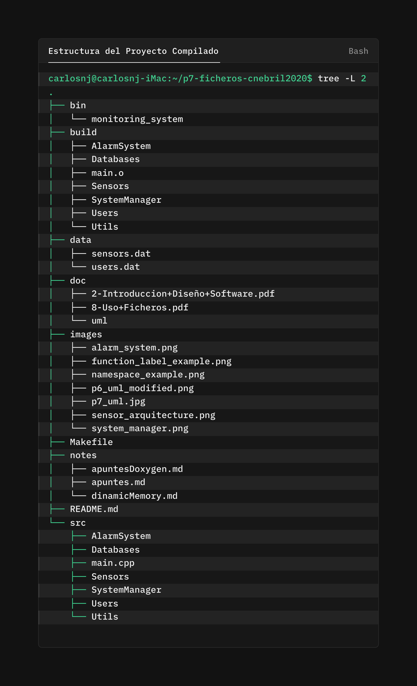
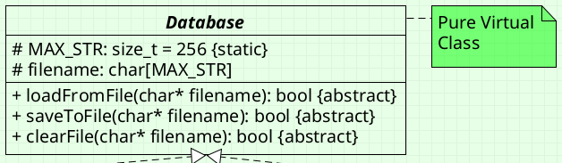
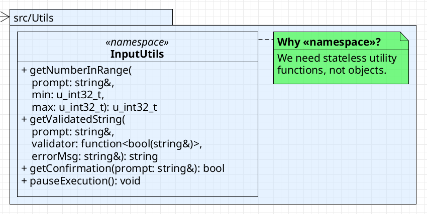
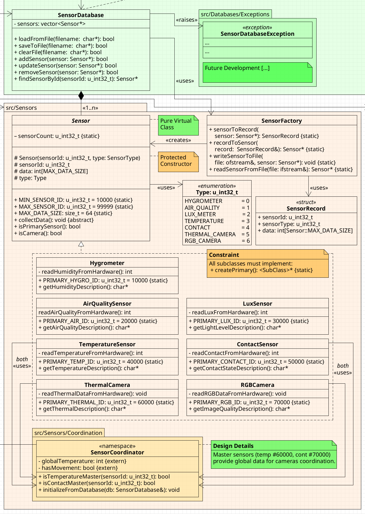
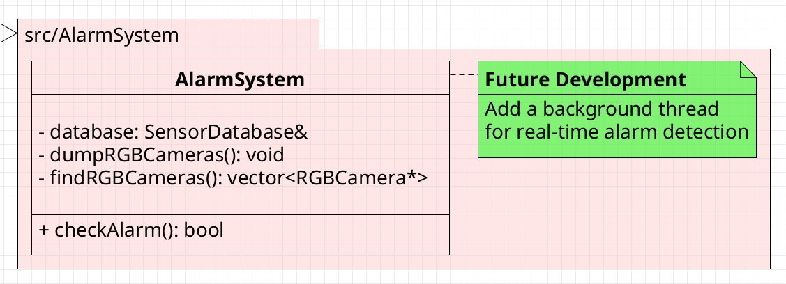
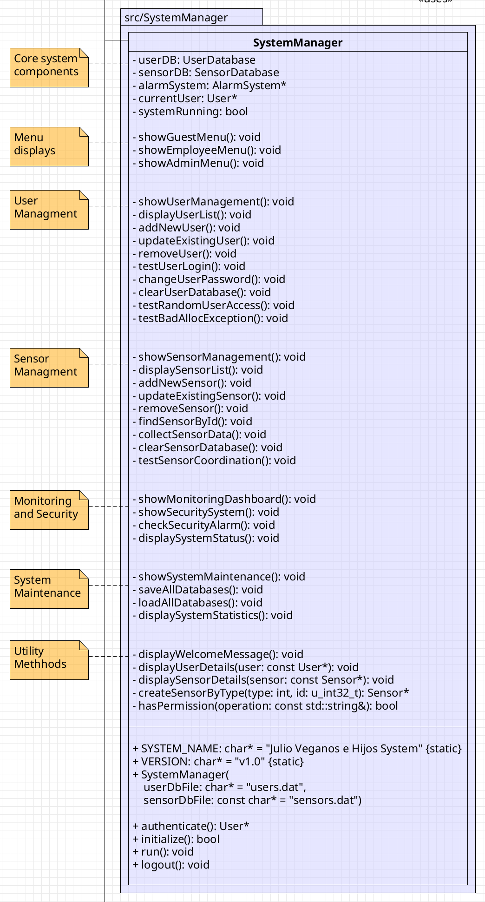

# Práctica 8. Gestión concurrente de sensores y actuadores

## Fecha límite

- 27/06/2025

## Autor
- Nebril Jiménez, Carlos

## Asignatura

- Ampliación de Sistemas Telemáticos (AST)

## Profesores de prácticas

- Julio Vega (julio.vega@urjc.es) y José González (jose.gcabanas@urjc.es)

## Objetivo

- Aunque el objetivo particular de la práctica es implementar el uso de ficheros, en realidad se trata de finalizar el sistema multisensorial del invernadero en Fuenlabrada, para la empresa: ***Julio Veganos e Hijos***. 

## Resumen

### Instrucciones para Ejecutar

#### 1. Clonar el repositorio:

```bash
git clone https://github.com/clases-julio/p7-ficheros-cnebril2020.git
cd p7-ficheros-cnebril2020
```

#### 2. Compilar y ejecutar el proyecto:

```bash
make run
```

O alternativamente:

```bash
make
./bin/monitoring_system
```

#### 3. Acceso al sistema 

Las credenciales del **administrador por defecto** del sistema son estas:

```bash
=== USER AUTHENTICATION ===
Enter user number (10000-99999): 10000
Enter NIF: 00000000
Enter password: admin
```

### Instrucciones Generales 

#### Limpieza del Proyecto 

Limpiar archivos de compilación y ejecución:

```bash
make clean
```

Limpiar completamente, **incluye datos**:

```bash
make distclean
```

#### Comando disponible de ayuda

```bash
make help
```

#### Archivos de Datos

El sistema crea automáticamente los siguientes archivos en el directorio `p7-ficheros-cnebril2020/data`:

- `users.dat` - Base de datos de usuarios
- `sensors.dat` - Base de datos de sensores

Estos archivos se crean automáticamente en la primera ejecución si no existen.

#### Solución de Problemas Frecuentes

1. Error de permisos:

```bash
chmod +x bin/monitoring_system
```

2. Directorios faltantes:

```bash
mkdir -p bin build data
```

3. Recompilación completa:

```bash
make distclean && make
```

### Estructura del Proyecto Compilado

<div align="center">
  
</div>

## MEMORIA FINAL (Hitos a Comentar - Particularidades)

Partiendo de la práctica anterior, vamos a intentar comentar todos los hitos más importantes de esta práctica. Para empezar, vamos a hacer un breve repaso de cómo nos quedamos en la práctica anterior:

<div align="center">
  
</div>

Partimos de un ejemplo [`main.cpp`](https://github.com/clases-julio/p6-excep-gdb-doxygen-cnebril2020/blob/main/src/Databases/userSetTest/main.cpp) que engloba todo el desarrollo de la parte de **Usuarios** exclusivamente. Un pequeño resumen de la **funcionalibilidad principal**, de lo implementado hasta ahora, sería:

1. **Menú interactivo** con 10 opciones (0-9)
2. **CRUD completo**: Crear, leer, actualizar y eliminar usuarios
3. **Autenticación**: Login y cambio de contraseñas
4. **Gestión de archivos**: Limpiar base de datos y acceso aleatorio a registros

Fue una pequeña prueba para poder comprobar que todo funcionaba correctamente y mejorar de cara al proyecto global, es decir, esta práctica.

Vamos a comentar, de forma cronológica, qué rumbo ha ido tomando la práctica global, sin centrarnos en los detalles ya que estamos desarrollando el código y la memoria de forma simultánea. 

### 1. Reformular el diagrama UML

Esto es un clásico en esta práctica y, aunque será definitivo hasta que llegue el día del examen (27 de junio), puedo comentar algunas particularidades sobre el mismo:

1. **Seguimos nuestro instinto**: la verdad es que hemos investigado bastante sobre cómo hacer el UML de la forma más estándar pero, cuantos más ejemplos hemos ido viendo, más nos damos cuenta que cada uno aplica su **estándar propio**. Lo que sí nos ha quedado claro es:

> El diagrama UML, independientemente de cómo lo hagas, tiene que **aclarar**, no liar más. <br> — *Regla de Oro Inquebrantable*

Teniendo en cuenta esto, hemos intentado ponernos en la posición de alguien recién llegado a nuestro diagrama para facilitar la comprensión del proyecto.

2. **Etiquetado de funciones**: para etiquetar las funciones, nos hemos decantado por usar corchetes (`{}`) e indicar de qué tipo es cada **atributo**. Ejemplo:

<div align="center">
  
</div>

3. **Mantener el diagrama SIEMPRE al día**: la verdad que, probablemente, sea la parte más tediosa del proyecto pero, sin duda, es la parte que reporta más beneficios. Tener un diagrama UML actualizado te ayuda a mantener la **visión global** del proyecto para tener claro cuál es el siguiente paso y no perderte en el código.

\[... Añadir más cosas si voy cambiando algo en el UML ...\]

### 2. Añadimos un nuevo \<\<namespace\>\>

Gracias a los aprendizajes del ejemplo anterior [`main.cpp`](https://github.com/clases-julio/p6-excep-gdb-doxygen-cnebril2020/blob/main/src/Databases/userSetTest/main.cpp), pudimos comprobar lo **poco escalable** que era la idea de obtener correctamente (esto es, siendo robusto a diferentes tipos de entradas: float, int, string, ...) cada dato proporcionado por el usuario, principalmente, porque se demandan demasiados datos.

Por esta misma razón hemos decidido implementar un nuevo **\<\<namespace\>\>** donde se agrupan distintas funciones para recopilar estos datos de forma robusta y escalable. La pregunta que nos surgió de primeras fue, ¿por qué un *namespace* en vez de usar una clase? Y es lo que he querido aclarar en el **comentario fijado** en el diagrama UML.

<div align="center">
  
</div>

El primer impulso al intentar agrupar **funciones útiles** (de ahí el nombre de la carpeta que engloba el nuevo *namespace*: `InputUtils`) para los *inputs* del usuario, fue **crear una clase**, idea que se tuvo que descartar por varias razones:

#### Razones por las que NO se debía crear una clase

1. Los métodos *static* se usan sólo para funciones que tienen que ver con el **comportamiento de la clase en general**, no con instancias concretas. Por ejemplo, en la clase [**User**](https://github.com/clases-julio/p7-ficheros-cnebril2020/blob/main/src/Users/User.h) he creado una variable *static* que se llama `userCount` que cuenta la cantidad de instancias que tiene la **clase, en general**. Si tu clase únicamente se conforma de **métodos *static***, saltan las primeras alarmas sobre si realmente estás haciendo algo útil.

2. Segundo problema, la clase `InputUtils` no tendría ningún atributo, error conceptual sobre las clases. Las clases en POO tienen que tener algún atributo que las defina, no se pueden instanciar. Si no se pueden instanciar, ¿para qué son realmente una clase? ¿el constructor y destructor son métodos necesarios en este caso?

Con estas dos razones, bastante contundentes, nos dimos cuenta que sólo necesitábamos **agrupar ciertas funciones** que estaban relacionadas entre sí. Y precisamente este propósito es para lo que se crearon los **\<\<namespaces\>\>**. 

#### Ejemplo en el `main.cpp`

Este cambio, nos permite dar mucha más flexibilidad en el ejemplo propuesto de la anterior práctica ([`main.cpp`](https://github.com/clases-julio/p6-excep-gdb-doxygen-cnebril2020/blob/main/src/Databases/userSetTest/main.cpp)) para evitar gestionar cada dato de forma independiente en cada operación con el usuario: eliminarlo, añadirlo, modificar su NIF, etc. En cada operación de este tipo tendríamos que comprobar la validez del dato introducido por el usuario (si se pide un número, que realmente sea un número) y ahora, simplemente usamos la función del *namespace* `InputUtils`. 

Un ejemplo de la modificación sobre **cómo añadir un usuario** en el programa, queda tal que así:

```c++
void testAddUser(UserDatabase& db) {
    cout << "\n=== Add New User ===" << endl;
    
    u_int32_t userNumber = InputUtils::getNumberInRange(
        "Enter user number (10000-99999): ", 10000, 99999);
        
    std::string nif = InputUtils::getValidatedString(
        "Enter nif: ",
        [](const std::string& s) { return !s.empty() && s.length() < User::MAX_NIF; },
        "NIF must be between 1 and 8 characters");
        
    std::string pwd = InputUtils::getValidatedString(
        "Enter password: ",
        [](const std::string& s) { return !s.empty() && s.length() < User::MAX_STR; },
        "Password must be between 1 and characters");
        
    u_int32_t roleChoice = InputUtils::getNumberInRange(
        "Select role (0 for ADMIN, 1 for EMPLOYEE): ", 0, 1);
    
    try {
        if (roleChoice == 0) {
            newUser = new Admin(userNumber, nif.c_str(), pwd.c_str(), User::ADMIN);
        } else {
            newUser = new Employee(userNumber, nif.c_str(), pwd.c_str(), User::EMPLOYEE);
        }
        // [...]
    }
    // [...]
}
```

### 3. Desarrollo de `src/Sensors`

En este apartado vamos a explicar, a grandes rasgos, en qué ha consistido el desarrollo de la gestión de los sensores y qué decisiones hemos decidido tomar.

Para empezar, decidimos mantener la misma arquitectura que la parte de los usuarios descrita en la práctica anterior, para mantener la sencillez y coherencia del sistema en general. De todas formas, y porque tiene un par de detalles interesantes, vamos a explicar en qué consiste todo lo relacionado con los sensores, desde que se crean (desde `SensorDatabase`) hasta que se almacenan (con ayuda de `SensorFactory`), pasando por sus características principales (clase `Sensor`) y cómo se coordinan entre cámaras y sensores (gracias a `SensorCoordinator`).  

Para que nos hagamos una idea de cómo está dispuesta esta parte del proyecto, tenemos el diagrama UML desarrollado para ello (ha cambiado bastante desde la anterior práctica):

<div align="center">
  
</div>

Como podemos observar, los diferentes apartados del proyecto están separados por `Packages` que, en nuestro caso, indican las diferentes carpetas en las que se divide la arquitectura del desarrollo. En el caso de los sensores, hemos agrupado todo estrechamente relacionado con ellos en la carpeta `src/Sensors`.

#### Arquitectura de los `Sensores`

##### 1. **Capa de Persistencia**
- **SensorDatabase**: Gestiona un `vector<Sensor*> sensors`, permite cargar, guardar y limpiar el fichero (con ayuda de `SensorFactory`) y, en un futuro, se desarrollarán excepciones concretas para esta clase. Además, dispone de las operaciones **CRUD** (Create, Read, Update & Delete) completas. 


##### 2. **Capa de Abstracción**
- **Sensor** (clase abstracta): es la interfaz común para todos los sensores, es decir, una especie de plantilla (sin referirnos a la `template` que proporciona C++).
- **SensorFactory**: es la clase encargada de, realmente, **fabricar sensores** desde un fichero (deserialización/serialización) de forma muy delimitada. Y decimos "realmente" porque la base de datos, cuando necesita cargar, guardar o limpiar el fichero de los sensores, por debajo está usando la clase **SensorFactory**. A este modelo de desarrollo se le llama patrón *Factory*.

##### 3. **Capa de Implementación**
Herencia especializada con **7 tipos de sensores** diferentes:
- **Sensores Ambientales**: Hygrometer (humedad), AirQualitySensor (calidad del aire), LuxMeterSensor (luminosidad), TemperatureSensor (temperatura).
- **Sensores de Seguridad**: ContactSensor (detector de movimiento). Tipo de sensor extra para ayudar en el `AlarmSystem`.
- **Sistemas de Cámaras**: ThermalCamera (cámara térmica), RGBCamera (cámara RGB)

Cada sensor implementa obligatoriamente:
- `collectData()`: Método virtual puro para recolección específica de datos. 
- `operator<<`: Sobrecarga para visualización personalizada según el tipo de sensor
- **Sensor primario**: cada familia de sensores tiene un sensor primario que **no se podrá eliminar**. En el caso de los sensores de temperatura y contacto, actuarán como **maestros** de las mediciones obtenidas por todas las cámaras y así, poder tener mediciones coherentes. 

##### 4. **Capa de Coordinación**
- **SensorCoordinator** (namespace): Coordina y sincroniza datos globales entre sensores para evitar inconsistencias
    - Gestiona **temperatura global**, de la que obtendrán información las **cámaras térmicas**
    - Controla **detección de movimiento** centralizada y **todas las cámaras RGB** se sincronizarán con estas medidas
    - Los sensores maestros actúan como **únicos proveedores de datos** para las cámaras de su tipo específico
    - Se hace uso de `SensorDatabase` para actualizar el estado al comenzar el programa.

#### Decisiones de Diseño en los Sensores

##### **¿Por qué sensores maestros?**
Nuestra forma de entender la empresa ***Julio Veganos e Hijos*** era, al menos, tener un sensor de cada tipo en el invernadero principal y, después poder añadir más sensores en otras áreas del espacio disponible. Bajo este contexto, se nos hacía bastante complicado pensar que, por ejemplo, la cámara térmica obtuviese una información distinta al valor obtenido en el sensor de temperatura, por lo que decidimos coordinarlo. 

Para no sobrecomplicarnos en exceso, hemos decidido crear un sensor **maestro** de temperatura y contacto, del que se obtienen todas las medidas de las cámaras, por lo que se asume entonces que todas las cámaras estarán dentro del invernadero principal. 

##### **Justificación del tipo de dato data**
Se decidió usar int `data[MAX_DATA_SIZE]` en lugar de un tipo específico por **flexibilidad**:
- **Sensores simples**: Usan solo `data[0]` (temperatura, humedad, luminosidad)
- **Sensores complejos**: Usan múltiples posiciones (cámaras RGB usan una matriz de valores usando 64 posiciones en `data`)

##### **Importancia del Patrón Factory**
Es **esencial** para la deserialización desde archivos binarios. Cuando cargamos sensores del fichero, no sabemos qué tipo de sensor crear hasta leer los datos. SensorFactory determina el tipo y construye la instancia correcta:

```c++
// SensorFactory decide qué tipo crear basándose en el tipo leído
switch (record.type) {
    case Sensor::TEMPERATURE: return new TemperatureSensor(record.sensorId);
    case Sensor::RADON: return new Radon(record.sensorId);
    // ...
}
```

### 4. Desarrollo de `src/AlarmSystem`

Siguiendo con la línea de desarrollo de evitar complicaciones innecesarias, y al tener ya desarrollado el `SensorCoordinator` se plantea una clase realmente sencilla donde se comprueba asíncronamente la **detección de movimiento inusual** en el invernadero. 

<div align="center">
  
</div>

Al ya tener implementada una clase donde se guarda el estado global del sensor **maestro** de movimiento, lo tomamos como referencia para saber discriminar si hay que activar la alarma o no. 

#### Funcionamiento principal:

##### 1. **Detección bajo Demanda**
- Consulta el estado del `SensorCoordinator` para verificar si hay **movimiento detectado**.

##### 2. **Volcado de datos de Cámaras**
- Cuando se detecta movimiento, automáticamente se realiza un volcado de datos de **todas** las cámaras `RGBCamera` disponibles.

##### 3. **Integración con Sensores**
- Utiliza `SensorDatabase` para **localizar** y **gestionar** las cámaras del sistema.

#### Limitaciones actuales:
Como se indica en el diagrama UML, el sistema actual no implementa hilos de ejecución, por lo que la comprobación de alarmas se realiza bajo demanda cuando el usuario accede al menú de seguridad. Una futura mejora sería implementar un **hilo en segundo plano** que monitorice continuamente los sensores de contacto.

### 5. Desarrollo de `src/SystemManager`

Había dos enfoques que consideramos respecto al último paso del sistema, es decir, hacer un programa que englobase todo el desarrollo del sistema, tanto la parte de sensores ([`main.cpp`](https://github.com/clases-julio/p7-ficheros-cnebril2020/blob/main/src/Databases/sensorVectorTest/main.cpp)) como la parte de usuarios ([`main.cpp`](https://github.com/clases-julio/p7-ficheros-cnebril2020/blob/main/src/Databases/userSetTest/main.cpp)):

1. Hacer otro `main.cpp` masivo englobando toda la nueva funcionalidad.
2. Crear una clase que \<\<use\>\> todas las funcionalidades del resto de componentes del sistema. 

Nos decantamos por la **segunda opción** por varias razones:

- **Interoperabilidad visual**: Al tener una clase `SystemManager`, podemos mostrar claramente en el diagrama UML cómo todas las clases del sistema interactúan entre sí, y tener una descripción completa de qué componentes tiene la clase. 
- **Testeo modular**: Permite probar el sistema completo como una unidad independiente de `main.cpp`, facilitando las pruebas en el código.
- **Reutilización**: se puede reutilizar cualquier parte del código fácilmente al formar parte de una clase, facilitando la **escalabilidad** del código. 

La realidad es que la razón de mayor peso es poder mostrar en qué consiste la clase principal del programa de forma visual en el UML, la parte **más importante** para nosotros en este proyecto:

<div align="center">
  
</div>

Aquí se muestra en qué consiste esta clase, heredando la funcionalidad que pusimos en práctica anteriormente en los programas de prueba para sensores ([`main.cpp`](https://github.com/clases-julio/p7-ficheros-cnebril2020/blob/main/src/Databases/sensorVectorTest/main.cpp)) y usuarios ([`main.cpp`](https://github.com/clases-julio/p7-ficheros-cnebril2020/blob/main/src/Databases/userSetTest/main.cpp)), incluyendo comentarios para diferenciar entre las distintas funciones. 

#### Arquitectura del `SystemManager`

Antes de describir brevemente la arquitectura del `SystemManager`, me gustaría dejar constancia del panorama global del proyecto con el UML completo del mismo:

<div align="center">
  
</div>

Ahora sí, el `SystemManager` actúa como **núcleo central** que integra todos los componentes del sistema en una interfaz unificada. 

##### **Componentes Integrados**
- **UserDatabase**: Gestión completa de usuarios con autenticación.
- **SensorDatabase**: Control total del sistema de monitorización.
- **AlarmSystem**: Sistema de seguridad automatizado.
- **SensorCoordinator**: Coordinación global de sensores.

##### **Control de Acceso por Roles**

```c++
// Tres niveles de acceso diferenciados
void showGuestMenu();     // Acceso público limitado
void showEmployeeMenu();  // Monitorización de solo lectura  
void showAdminMenu();     // Control total del sistema
```

##### **Funcionalidades Principales**
- **Gestión de Usuarios**: CRUD completo, autenticación, cambio de contraseñas.  
- **Gestión de Sensores**: Monitorización, configuración, recolección de datos.  
- **Sistema de Seguridad**: Alarma, detección de movimiento y volcado de datos de cámaras.  
- **Mantenimiento**: Backup/restore de bases de datos, estadísticas del sistema.  

El resultado es un **punto de entrada único** que orquesta todo el ecosistema del invernadero de ***Julio Veganos e Hijos***.  

Creemos que ha sido una de las mejores decisiones del proyecto ya que permite una **simplificación** casi completa del `main.cpp`:

```c++
int main() {
    try {
        cout << "Starting Julio Veganos e Hijos Monitoring System..." << endl;
        
        // Inicialización del sistema con archivos de base de datos
        SystemManager system("data/users.dat", "data/sensors.dat");
        
        // Inicialización de todos los componentes del sistema
        if (!system.initialize()) {
            cerr << "FATAL ERROR: System initialization failed!" << endl;
            return 1;
        }
        
        // Ejecución del bucle principal del sistema
        system.run();
        
        cout << "System shutdown completed successfully." << endl;
        return 0;
        
    } catch (...) {}
}
```